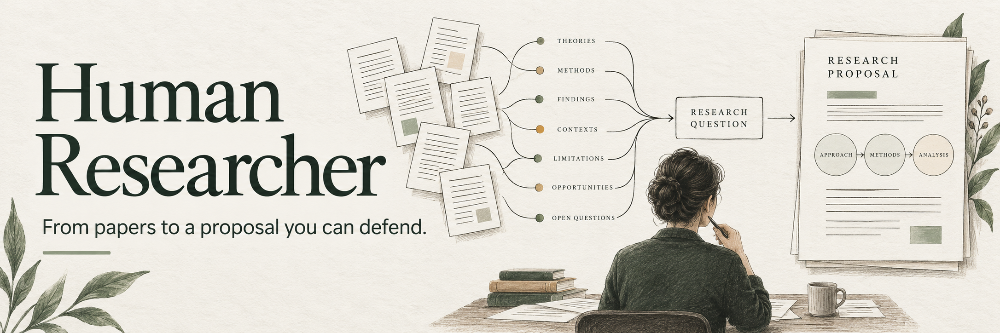
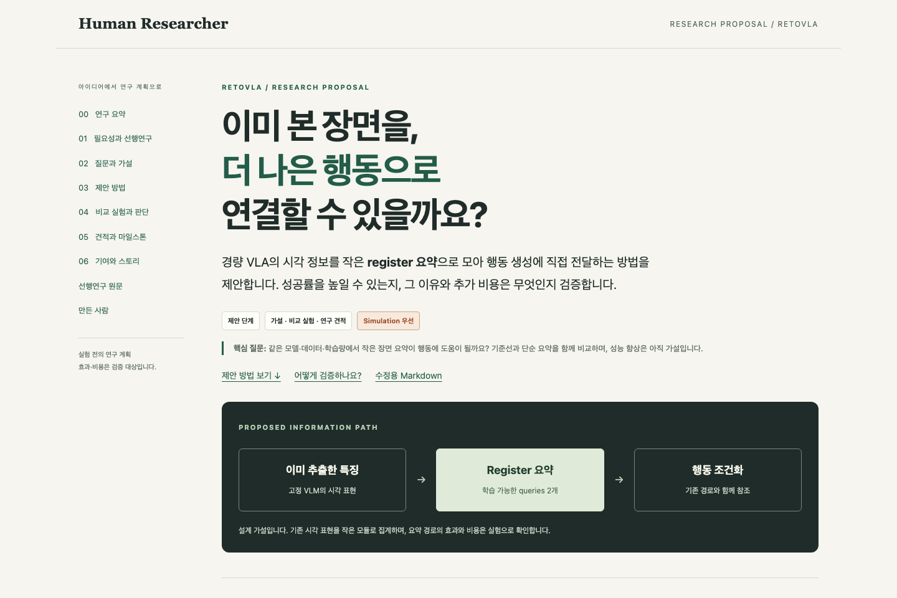
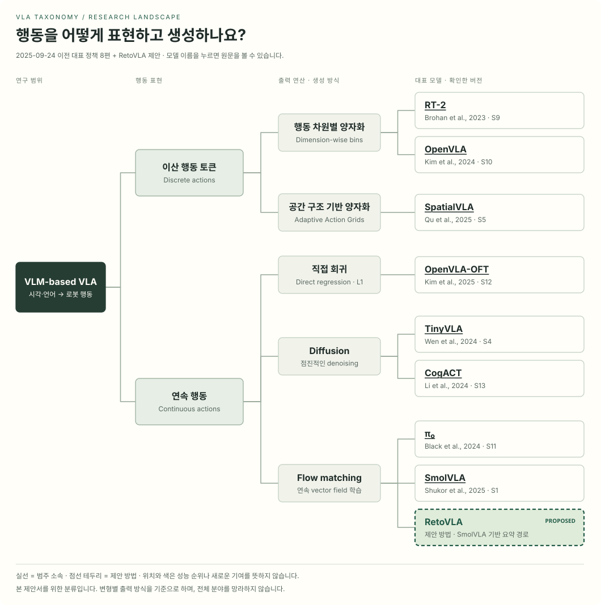
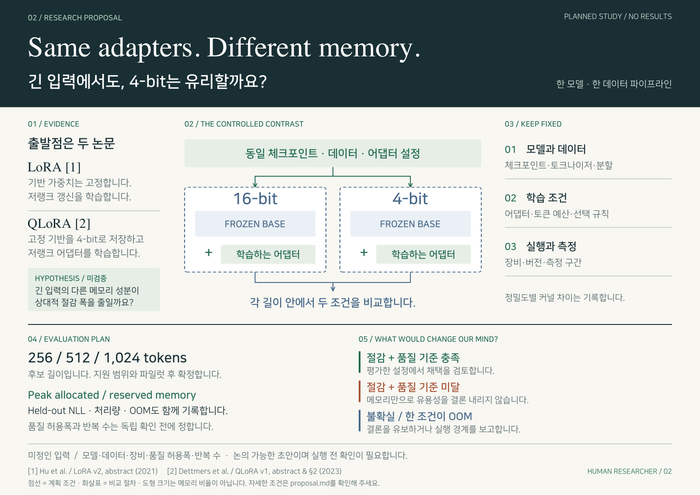
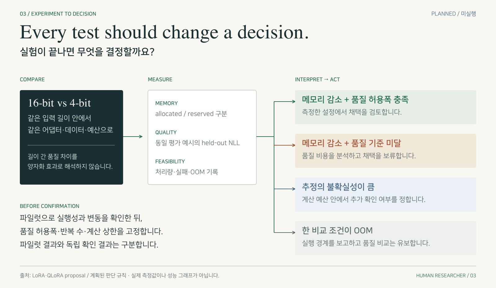
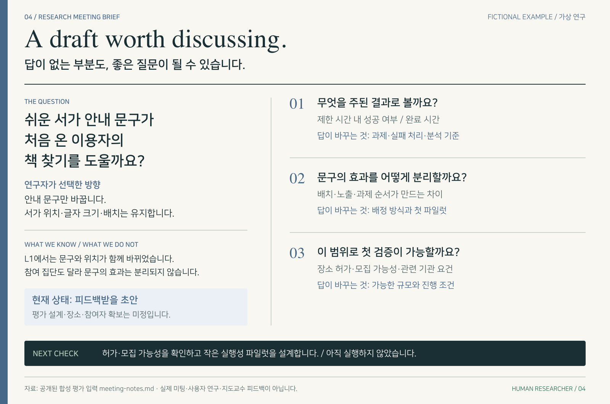
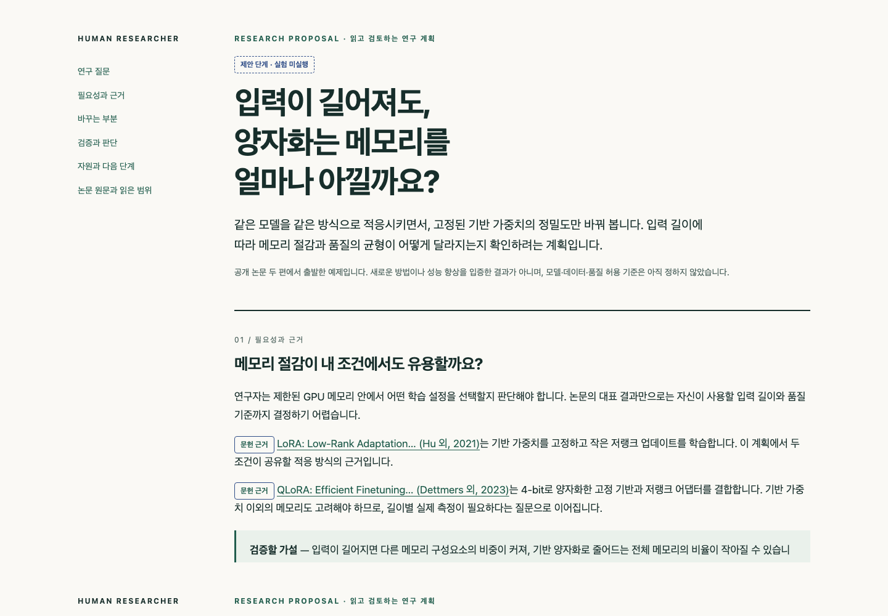

<p align="center"></p>

<p align="center"><strong>Claude Code·Codex에 설치하는 연구용 에이전트 스킬 모음</strong><br/>논문 탐색 · 연구 아이디어 · 실험 설계 · Proposal 작성과 검토</p>

<p align="center">
  <a href="#바로-시작하기">설치하고 사용하기</a> ·
  <a href="#결과물-먼저-보기">결과물 보기</a> ·
  <a href="docs/guide.md">사용 가이드</a> ·
  <a href="README.en.md">English</a>
</p>

[](https://github.com/taewan2002/human-researcher/actions/workflows/validate.yml)
[](https://github.com/taewan2002/human-researcher/releases/tag/v0.1.0)
[](LICENSE)

논문·아이디어·초안을 바탕으로 **왜 필요한 연구인지, 주어진 자원으로 풀 수 있는지, 무엇으로 검증할지**를 구체화합니다. 목표는 연구자가 스스로 설명하고 방어할 수 있는 연구계획서(proposal)입니다.

| 논문과 분야를 이해합니다 | 연구 질문과 계획을 만듭니다 | Proposal을 작성하고 다듬습니다 |
|---|---|---|
| 논문 읽기 · 후속 인용 탐색 · 문헌 분류(taxonomy) | 아이디어 구체화 · 실험 설계 · 자원·일정 견적 | 초안 작성 · 근거 기반 검토 · HTML·포스터 정리 |

**연구 스킬 7개와 사용 안내 1개**가 들어 있습니다. 논문 한 편, 막연한 아이디어, 기존 초안 중 지금 가진 자료에서 시작하고 필요한 작업만 요청하시면 됩니다.

## 결과물 먼저 보기

**RetoVLA 연구 아이디어를 proposal로 구성한 예제입니다.** 선행연구 13편과 VLA taxonomy에서 출발해 제안 방법, 비교 실험, RTX 5090 1개 기준의 조건부 자원·일정 계획으로 연결합니다.

[](examples/retovla/README.md)

[예제와 사용 요청 보기](examples/retovla/README.md) · [Proposal 읽기](examples/retovla/proposal.md) · [VLA taxonomy](examples/retovla/taxonomy.md) · [다른 결과물 보기](examples/README.md)

공개 자료를 바탕으로 검토·편집한 **실험 전 제안서 예제**입니다. 성능 향상은 검증할 가설이며, 한 번의 자동 생성 결과나 스킬 성능 측정치로 제시하지 않습니다. HTML 화면은 [프로젝트 ZIP](https://github.com/taewan2002/human-researcher/archive/refs/tags/v0.1.0.zip)을 내려받아 압축을 푼 뒤 `examples/retovla/proposal-reader.html`을 열면 볼 수 있습니다.

## 바로 시작하기

**1. 에이전트에게 설치를 요청해 주세요.**

```text
아래 설치 안내를 읽고 Human Researcher의 연구 스킬 7개와 사용 안내 스킬 1개를 설치해 주세요.
https://raw.githubusercontent.com/taewan2002/human-researcher/v0.1.0/docs/installation.md
```

**2. 논문·메모를 첨부하고 원하는 결과를 알려 주세요.**

```text
write-proposal로 이 논문들과 제 아이디어를 연구 proposal로 발전시켜 주세요.
관심 질문은 [알아보고 싶은 것]이고, 가용 자원은 [장비·시간·데이터]입니다.
제가 선택한 방향을 유지해 주세요. 선행연구와 검증 계획을 확인하고,
현재 자료로 해결할 수 있는 빈틈은 수정해 주세요. 남은 가정도 표시해 주세요.
```

아이디어만 있어도 시작할 수 있습니다. 논문 한 편은 `read-paper`, 기존 초안은 `review-proposal`로 시작해 보세요. **7개를 순서대로 호출할 필요는 없습니다.**

[첫 사용부터 결과 검토까지 따라 하기 →](docs/guide.md) · [설치·업데이트 안내](docs/installation.md)

## 연구 스킬 한눈에

| 지금 원하는 일 | 스킬 | 받게 되는 결과 |
|---|---|---|
| 논문 한 편을 제대로 이해하기 | [read-paper](skills/read-paper/SKILL.md) | 큰 그림, 핵심 주장, 근거 위치, 깊이 읽을 부분 |
| 다음에 읽을 논문과 연구 흐름 찾기 | [trace-research](skills/trace-research/SKILL.md) | 후속 인용·저자·연구실 흐름과 Literature Survey |
| 분야 전체와 내 아이디어의 위치 보기 | [map-field](skills/map-field/SKILL.md) | 근거가 연결된 계층형 taxonomy와 비교 |
| 막연한 생각을 연구 질문으로 만들기 | [develop-idea](skills/develop-idea/SKILL.md) | 질문·가설·가까운 선행연구·강한 반론 |
| 어떻게 검증할지 정하기 | [design-research](skills/design-research/SKILL.md) | 방법·비교군·측정·자원·일정·결과별 판단 |
| 하나의 연구 계획으로 완성하기 | [write-proposal](skills/write-proposal/SKILL.md) | 목표 학회·저널을 반영한 proposal과 시각적 설명 |
| 초안을 점검하고 개선하기 | [review-proposal](skills/review-proposal/SKILL.md) | 핵심 결함, 근거 기반 점수, 적합성 검토와 요청한 수정 |

사용 안내 [using-human-researcher](skills/using-human-researcher/SKILL.md)는 현재 자료와 막힌 지점을 바탕으로 다음 작업을 고르도록 돕습니다. 모든 스킬을 순서대로 거칠 필요는 없습니다.

## 왜 Human Researcher인가요?

이 프로젝트는 좋은 논문을 위한 출발점으로 **무엇을, 왜, 어떻게 연구할지 판단하는 과정**에 집중합니다. 왜 풀어야 하는 문제인지, 기존 연구에서 무엇이 부족한지, 어떤 근거가 있어야 내 주장을 받아들일 수 있는지를 proposal에 담습니다.

이름의 **Human**은 연구의 주도권과 책임이 연구자에게 있다는 뜻입니다. AI는 질문과 가설을 제안하고, 근거와 반론을 찾고, 검증을 설계하는 데 함께합니다. 연구자는 선택의 이유를 이해하고, 새로운 근거에 따라 판단을 수정하며, 연구의 방향을 결정합니다.

**우리가 지향하는 결과는 연구자가 스스로 설명하고 방어할 수 있는 연구 계획입니다.** 완성도 높은 proposal을 향해 초안을 쓰고, 빈틈을 드러내고, 피드백으로 다듬어 갑니다.

## 더 다양한 결과물

**VLA 분야의 구조와 제안 위치.** 대표 정책 8편을 행동 표현과 생성 방식으로 분류하고, RetoVLA 아이디어가 어느 접근과 연결되는지 보여줍니다.

[](examples/retovla/taxonomy.md)

[분류 기준과 근거](examples/retovla/taxonomy.md) · [선행연구와 작성 범위](examples/retovla/sources.md)

**01 · 연구의 구조를 그립니다.** 실제 PEFT 논문 7편을 주요 적응 메커니즘으로 분류하고, 각 방법의 위치와 별도로 봐야 할 축을 보여줍니다.

[](examples/peft-taxonomy/README.md)

[분류 근거와 논문 출처](examples/peft-taxonomy/evidence.md) · [편집 가능한 SVG](examples/peft-taxonomy/taxonomy.svg)

**02 · 연구 계획을 한 장에 설명합니다.** LoRA·QLoRA에서 출발한 질문을 근거·공정한 비교·측정·결과별 판단으로 연결한 A3 포스터입니다.

[](examples/quantized-adaptation/poster.pdf)

[PDF](examples/quantized-adaptation/poster.pdf) · [편집 가능한 HTML](examples/quantized-adaptation/poster.html) · [전체 proposal](examples/quantized-adaptation/proposal.md)

| 03 · 실험에서 다음 결정으로 | 04 · 초안에서 연구 미팅으로 |
|---|---|
| [](examples/quantized-adaptation/evaluation.svg) | [](examples/research-meeting/README.md) |
| 무엇을 관측하면 계획을 바꿀지 보여줍니다. | 미해결 쟁점과 조언을 구할 질문을 연결합니다. |

공개 논문 또는 합성 자료를 바탕으로 검토·편집한 예제입니다. 계획과 실제 결과를 구분하며, 논문 보고값은 출처와 함께 표시합니다. 스킬의 성능 측정치로 제시하지 않습니다. 이미지를 누르면 확대하거나 근거와 함께 확인할 수 있습니다.

[시각화 갤러리 전체 보기 →](examples/README.md) · [혼합형·미확인 문헌을 다루는 taxonomy](examples/visual-taxonomy/README.md)

**전체 proposal도 브라우저에서 읽을 수 있습니다.** 필요성 → 바꾸는 부분 → 검증과 판단을 따라 읽고, 인용된 논문 제목을 눌러 원문 링크와 근거를 확인합니다. 화면에 맞는 HTML, 수정용 Markdown, 한 장 포스터 중 필요한 형식을 요청해 주세요.

[](examples/quantized-adaptation/proposal-reader.html)

[HTML 읽기 화면 예제](examples/quantized-adaptation/proposal-reader.html) · [요청 방법과 파일 여는 법](docs/guide.md#브라우저에서-읽고-근거를-따라가고-싶을-때)

## 좋은 proposal을 만드는 세 가지 연결

**문헌에서 질문으로.** Literature Survey는 기반·최근·가장 가까운 연구와 반대 근거를 함께 읽고, 무엇이 알려졌으며 어떤 질문이 남는지 설명합니다. 실제 후속 인용과 주제상 관련 논문을 구분하고, 근거로 돌아갈 수 있는 위치를 남깁니다.

**질문에서 검증으로.** 방법만 제안하지 않고, 어떤 비교가 가설을 구별하며 어떤 결과에서 방향을 바꿀지 계획합니다. 예상 효과와 이미 확인된 결과를 구분합니다.

**연구에서 독자로.** 목표 학회·연도·트랙 또는 저널·논문 유형의 공식 기준을 확인하고, 기여·검증·일정에 연결합니다. 연구 자체의 준비도와 제출처 적합성은 따로 판단합니다. 목표가 정해지지 않았다면 질문부터 진행합니다.

[목표 학회·저널 반영](skills/write-proposal/references/publication-target.md) · [Proposal 완료 기준](skills/write-proposal/references/proposal-contract.md)

## 시작 전에 연구의 견적을 잡습니다

**필요한 연구인지, 풀 가능성이 있는지, 무엇부터 확인할지**를 함께 따집니다. 가장 위험한 가정과 작은 판별 검증을 먼저 정하고, 사람의 작업 시간·장비 사용 시간·외부 대기를 구분합니다. 다음 단계로 계속할지, 범위를 줄일지, 멈출지 판단할 기준을 남깁니다.

연구의 스토리도 **독자가 공감할 필요성 → 기존 접근의 한계 → 질문 → 제안한 통찰 → 필요한 근거 → 결과에 따른 기여**로 연결합니다. 결과를 보기 전에 해석 기준을 정하고, 지표가 질문의 개념을 실제로 측정하는지 확인합니다.

[연구 주장과 견적 표](skills/write-proposal/references/research-argument.md) · [연구 철학과 출처](docs/research-foundations.md)

## 좋은 연구 조언을, 실제 연구 습관으로

『대학원생 때 알았더라면 좋았을 것들』 [1권](https://www.yes24.com/product/goods/72231788)과 [2권](https://www.yes24.com/product/goods/109305004)의 공개 발췌에서 연구의 주도권, 새로운 질문의 탐구, 질문하고 피드백받는 태도를 참고해 지침을 다듬었습니다.

- **내 질문과 판단을 지킵니다.** AI의 추천과 연구자의 결정을 구분합니다.
- **무엇을 배울지 계획합니다.** 문헌과 실험이 어떤 불확실성을 줄이고 다음 판단에 어떻게 연결되는지 설명합니다.
- **논의할 수 있는 초안을 만듭니다.** 미팅을 준비할 때 현재 근거·미해결 쟁점·조언을 구할 질문을 간결하게 정리합니다.

완성도 높은 proposal은 근거와 한계를 설명하고 다음 검증을 결정할 수 있어야 합니다. 모르는 것을 드러내고 피드백받을 수 있는 상태도 중요합니다.

[책의 조언과 스킬 적용, 쪽수·출처](docs/research-foundations.md) · [미팅 준비 요청 예시](docs/guide.md#지도교수동료와의-미팅을-준비할-때)

## 점수보다, 다음에 고칠 것이 보이도록

요청하시면 proposal을 다음 다섯 기준으로 평가합니다. 각 점수에는 **근거 위치·판단 이유·다음 개선 조치**가 함께 제시됩니다.

| 기준 | 확인하는 것 |
|---|---|
| **Timely** | 왜 지금 풀어야 하는 문제인가요? |
| **Practical** | 어떤 실용적·학문적 가치를 주나요? |
| **Analytical** | 질문·가설·작동 원리와 반론을 설명할 수 있나요? |
| **Implementable** | 주어진 자원으로 실행할 구체적인 경로가 있나요? |
| **Measurable** | 지표가 질문의 개념을 측정하며, 의미 있는 차이와 판단 부족을 구별하나요? |

항목별 **0–4점**, 모두 평가할 수 있으면 **20점 만점**이며 100점 환산도 가능합니다. 자료 부족은 **미평가**로 남기고 전체 총점을 보류합니다. 핵심 결함은 총점과 별도로 표시합니다. 문서 점수와 연구자 본인의 이해도도 구분합니다.

[평가 요청 예시와 결과 읽는 법](docs/guide.md#평가표-읽기) · [세부 채점 기준](skills/review-proposal/references/proposal-scorecard.md)

## 자주 묻는 질문

<details>
<summary><strong>논문이나 목표 학회가 아직 없어도 되나요?</strong></summary>

관심 분야와 제약부터 알려 주세요. 문헌을 찾으려면 `trace-research`, 질문을 구체화하려면 `develop-idea`로 시작해 보세요. 미정인 사항은 미정으로 남겨도 괜찮습니다.

</details>

<details>
<summary><strong>스킬을 전부 설치하고 순서대로 써야 하나요?</strong></summary>

필요한 스킬만 설치해도 됩니다. 각 패키지는 독립적으로 사용할 수 있고, `write-proposal`에는 자체 검토와 수정 과정이 포함되어 있습니다. 짧은 요약이나 문장 수정에 전체 연구 과정을 강제하지 않습니다.

</details>

<details>
<summary><strong>별도 서버나 API 키가 필요한가요?</strong></summary>

Human Researcher 자체의 계정·서버·DB·API 키는 필요하지 않습니다. 사용하시는 에이전트의 모델과 검색·파일 도구를 활용합니다. 에이전트와 외부 서비스의 비용·데이터 처리 방식은 각각의 설정을 따릅니다.

</details>

<details>
<summary><strong>한글로 쓰거나, 검색 없이 내 자료만 사용할 수 있나요?</strong></summary>

가능합니다. 요청하신 언어를 따르며, “외부 검색 없이 첨부 자료만 사용해 주세요”라고 범위를 정할 수 있습니다. 이때 최신 문헌 전체를 확인했다고 주장하지 않고, 접근 가능한 자료 안에서 근거와 한계를 표시합니다.

</details>

## 더 알아보기

[한국어 사용 가이드](docs/guide.md) · [English guide](docs/guide.en.md) · [설치](docs/installation.md) · [워크플로](docs/workflows.md) · [연구 철학](docs/philosophy.md) · [기여](CONTRIBUTING.md) · [변경 기록](CHANGELOG.md) · [버전 관리](docs/releases.md)

구조·설치 검증과 모델 행동 평가는 구분합니다. 저장소에는 **58개 합성 행동 사례**가 정의되어 있으며, 이는 전체 통과율이나 실제 연구 효용을 뜻하지 않습니다. 자세한 내용은 [검증 범위와 한계](docs/evaluation.md)에서 확인할 수 있습니다.

코드와 지침은 [MIT License](LICENSE)를 따릅니다. 외부 논문·데이터·모델에는 각 출처의 조건이 적용됩니다. [이미지 제작 기록](docs/assets/README.md)
