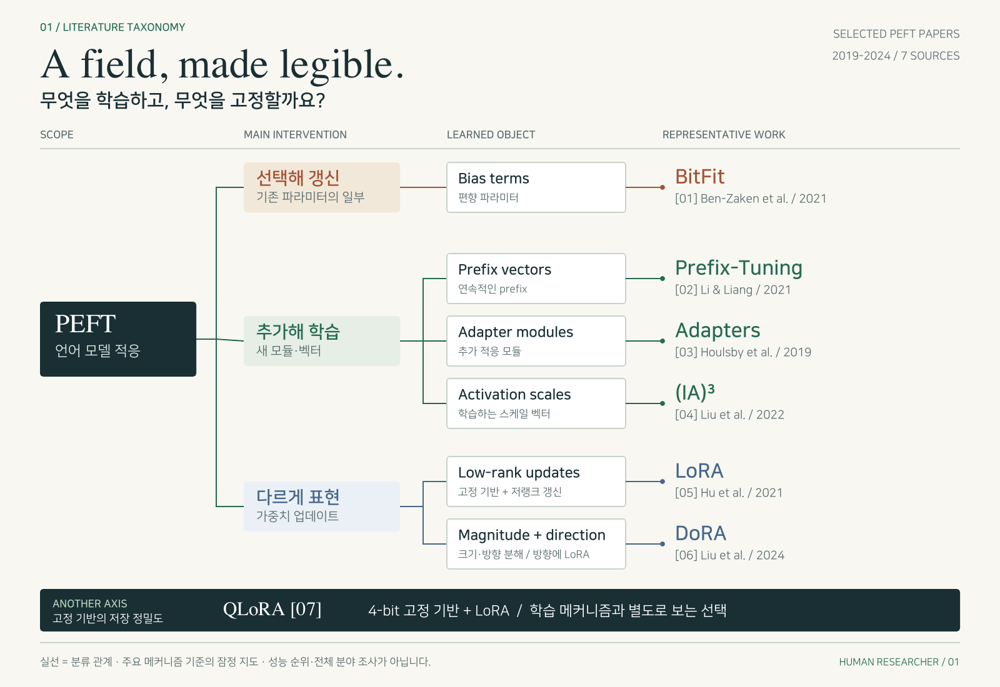

# PEFT: 무엇을 학습하고 무엇을 고정할까요?

[갤러리](../README.md) · [편집 가능한 SVG](taxonomy.svg) · [분류 근거와 출처](evidence.md)



실제 논문 7편을 바탕으로 **주로 무엇을 학습하는가**를 정리한 지도입니다. 큰 범주, 학습 대상, 대표 논문을 서로 다른 열에 배치했습니다. 각 논문 이름을 SVG에서 클릭하면 확인한 버전으로 이동합니다.

- 기존 파라미터의 일부를 갱신하는 방법: **BitFit**.
- 새 모듈·벡터를 학습하는 방법: **Prefix-Tuning, Adapters, (IA)³**.
- 가중치 업데이트를 재매개변수화하는 방법: **LoRA, DoRA**.
- 별도로 볼 선택: **QLoRA의 고정 기반 양자화**. 학습 메커니즘과 저장 정밀도를 같은 분기 기준으로 섞지 않았습니다.

이 구분은 확인한 논문들의 주요 메커니즘을 설명하기 위한 자체 분류입니다. 부가적으로 학습하는 모든 파라미터를 열거한 분류, 배타적인 전체 분야 taxonomy, 성능 순위, 최신 문헌의 전수 조사가 아닙니다. 실선은 분류 관계이며 인용이나 발전 순서를 뜻하지 않습니다.

## 이렇게 요청해 보세요

```text
map-field로 이 논문들의 주요 적응 메커니즘을 계층형 taxonomy로 그려 주세요.
분기 기준과 대표 방법을 구분하고, 서로 다른 분류 축은 별도로 보여 주세요.
각 말단에 출처와 확인한 버전을 연결해 주세요.
편집 가능한 SVG와 분류 근거를 함께 저장해 주세요.
```

그다음에는 “어댑터를 같게 두고 기반 가중치의 정밀도만 바꾸면 무엇을 알 수 있을까요?”라는 질문으로 [proposal 예제](../quantized-adaptation/README.md)에 이어갈 수 있습니다. 이 지도만으로 신규성이나 성능 우위를 주장하지 않습니다.
