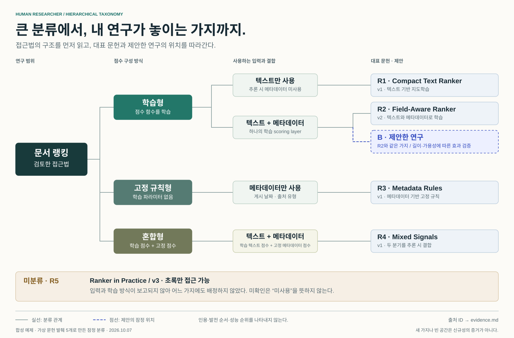

# 내 아이디어의 위치를 보여주는 taxonomy

가상 문헌 5편으로 만든 편집 가능한 [계층형 SVG 지도](taxonomy.svg)입니다. 큰 범주에서 세부 접근법을 거쳐 대표 문헌까지 가지가 갈라집니다. [문헌 발췌](../../tests/fixtures/visual-papers.md)와 [연구 메모](../../tests/fixtures/visual-project.md)만 사용했습니다. 실제 연구 분야의 현황이나 성능을 주장하지 않습니다.

## 그림을 읽는 법

- 첫 분기: 학습형, 고정 규칙형, 두 점수를 결합하는 혼합형 중 무엇인가요?
- 세부 분기: 그 방식에서 추론 시 어떤 입력을 어떻게 사용하나요?
- 말단: 해당 접근에 속하는 대표 문헌. 제안 B는 R2와 같은 가지의 점선 노드입니다.
- 실선은 분류 관계이며, 인용·발전 순서·성능 순위를 뜻하지 않습니다. R5는 분류에 필요한 정보가 없어 트리 밖에 남겼습니다.

R1은 텍스트 학습, R2는 결합 학습, R3는 메타데이터 고정 규칙, R4는 결합 혼합 방식입니다. R5는 입력과 학습 방식이 모두 미확인입니다. B는 R2와 같은 가지에 있습니다. **새 가지를 그리거나 빈 공간을 찾았다는 사실로 신규성을 주장하지 않습니다.**

이 예제는 혼합형을 별도 의미 있는 범주로 둡니다. 다른 문헌 집합에서 여러 범주에 속하는 방법이 있다면, 하나의 방법 노드에 여러 부모를 연결하는 네트워크로 확장할 수 있습니다. 구성 요소 사용이나 인용을 추가로 표시할 때는 분류선과 다른 선 종류·범례를 사용합니다.

[분류 근거와 미확인 항목](evidence.md)은 각 문헌 ID에 대응합니다. 이 지도에는 성능 순위나 인용 관계를 뜻하는 시각적 부호가 없습니다.

## 다음 연구 결정

선택한 B를 유지하면서 메타데이터의 실제 연결·제거·셔플 조건을 비교할 계획입니다. 길이와 메타데이터 가용성에 따른 차이를 평가하려면 길이 구간, 추론 시 정보 접근, 지연 허용 범위부터 정해야 합니다. 지도는 그 결정을 돕고, 실험 결과를 대신하지 않습니다.

브라우저나 벡터 편집기로 SVG를 열 수 있습니다. 글자와 도형이 편집 가능하고, 외부 이미지·폰트·서비스는 필요하지 않습니다. SVG와 근거 문서를 함께 보관해 주세요. [Mermaid 구조 원본](taxonomy.mmd)은 같은 노드와 분류 관계를 텍스트로 표현합니다. 논문을 추가하거나 가지를 바꿀 때 활용할 수 있으며, 렌더러에 따라 배치는 달라집니다.

이 예제는 검토·편집한 설명용 자료입니다. 실제 스킬 행동 평가와 구분합니다. Proposal 전체의 시각화는 [한 장 포스터 예제](../quantized-adaptation/README.md)를 참고해 주세요.
